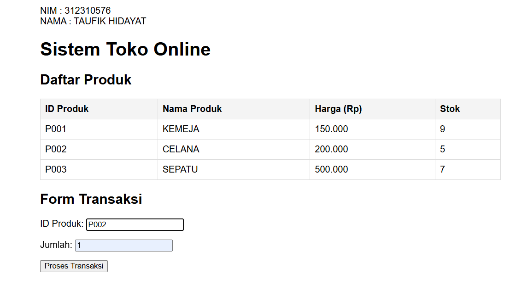

## Lab Informatika
| LAB  |  Minggu 1
|-------|---------
| NIM   | 312310576
| Nama  | Taufik Hidayat
| Kelas | TI.23.A6

### Sebuah toko online menjual beberapa produk dengan detail sebagai berikut:


### Anda diminta untuk membuat program yang dapat mensimulasikan transaksi pembelian pada toko tersebut. Program harus mampu melakukan hal-hal berikut:

- Masuk ke terminal mysql

```
#mysql -h127.0.0.1 -uroot
```

- Buat Database dan gunakan Database
```
CREATE DATABASE toko_online;
USE toko_online;
```
- Buat Table Product
```
CREATE TABLE product (
    id VARCHAR(10) PRIMARY KEY,
    nama VARCHAR(100) NOT NULL,
    harga DECIMAL(10,2) NOT NULL,
    stok INT NOT NULL
);
```
- buat data dalam product
```
INSERT INTO products (id, nama, harga, stok) VALUES
('P001', 'KEMEJA', 150000, 10),
('P002', 'CELANA', 200000, 5),
('P003', 'SEPATU', 500000, 7);
```
#### 1. Memilih Produk
-	a. Pembeli memasukkan ID produk yang ingin dibeli dan jumlahnya.
 


#### 2. Validasi Stok

-	a. Program harus memeriksa apakah stok mencukupi. Jika stok tidak mencukupi, program harus menampilkan pesan: "Maaf, stok untuk [Nama Produk] tidak mencukupi." Jika stok mencukupi, lanjutkan ke langkah berikutnya.

 

#### 3. Hitung Total Harga

 -a. Hitung total harga berdasarkan jumlah yang dibeli.
 
 


#### 4. Terapkan Diskon
	
- a. Berlaku aturan diskon berikut:

1.	Diskon 10% untuk total belanja lebih dari Rp500.000.

2.	Diskon 5% untuk total belanja lebih dari Rp250.000 dan kurang dari atau sama dengan Rp500.000.

3.	Tidak ada diskon jika total belanja kurang dari atau sama dengan Rp250.000.

  
 
#### 5. Hitung Pajak

- a. Setelah diskon diterapkan, tambahkan pajak sebesar 10% dari nilai total yang sudah didiskon.

 
 
#### 6. Output Struk Transaksi

- Jika transaksi berhasil, tampilkan struk transaksi seperti berikut:


 


```
Input Format
ID produk (string)
Jumlah pembelian (integer)
Output Format
Pesan validasi stok jika stok tidak mencukupi.
Struk transaksi jika transaksi berhasil.
```

## Selesai
